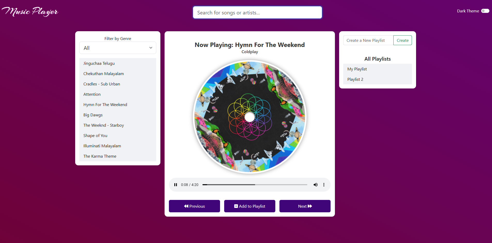
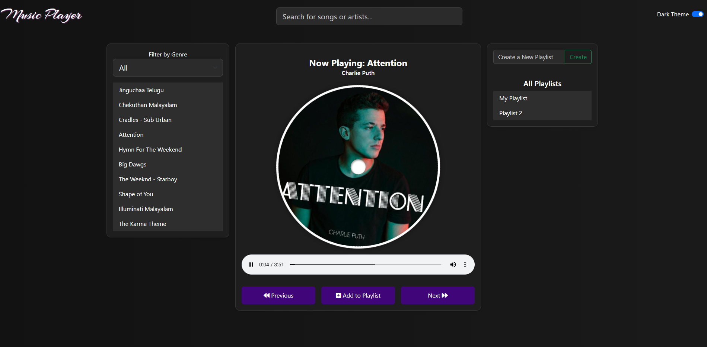
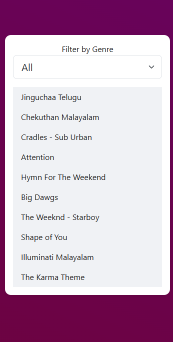
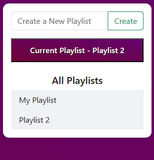
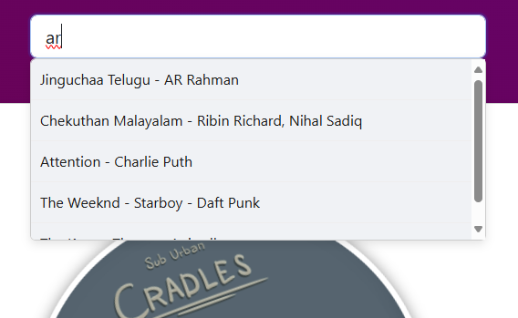

# 🎵 Music Player Web App

This is a feature-rich, responsive web-based music player that allows users to play locally stored songs, manage custom playlists, filter by genre, and switch between dark and light themes — all without the hassle of ads or account logins.

---

## 📌 Features

### 🎧 Music Playback

- Play, pause, and navigate through songs using **Previous** and **Next** buttons.
- Automatically plays the next song when one ends.
- Visually represents the current song as a rotating **CD** with a center hole.

### 📂 All Songs Section

- Lists all available songs.
- Filter songs by **genre** (Pop, Rock, Hip-Hop).
- Click a song to instantly play it.

### 🪪 Song Card Section

- Displays the **currently playing song**, including:
  - Title
  - Artist
  - Album art
- CD spins during playback and pauses when the song is paused/stopped.

### 📋 Playlist Management

- Create new custom playlists.
- Add songs to selected playlists.
- View and collapse the current playlist.
- Remove songs from playlists.
- Persistent structure stored in memory (JavaScript arrays).

### 🔍 Search

- Live search as you type.
- Filter songs by name or artist.
- Dropdown suggestion box displays matching results.

### 🌗 Toggle Theme

- Seamlessly switch between **Dark** and **Light** modes using a toggle switch in the header.
- All UI components adapt their colors based on the selected theme.

---

## 📁 Project Structure

```
📁 media/
    └── 1.jpg, 1.mp3, ... 10.jpg, 10.mp3
📄 index.html
📄 style.css
📄 player.js
```

---

## 🚀 Getting Started

### 🧱 Prerequisites

- A modern browser (Chrome, Firefox, Edge)
- Internet connection to load Bootstrap and Font Awesome

### 🛠 Setup Instructions

1. Clone or download the project files:

   ```bash
   git clone https://github.com/yourusername/music-player.git
   ```

2. Open `index.html` in your browser.

3. Enjoy playing music, managing playlists, and switching themes.

> ⚠️ Note: All music and image files must be placed in a `media/` folder as referenced in the code.

---

## 🧪 Technologies Used

- **HTML5** for structure
- **CSS3** (with custom + Bootstrap styling)
- **JavaScript** (ES6) for all interactivity
- **Bootstrap 5** for layout and components
- **Font Awesome** for icons
- **Vanilla DOM API** for playlist and music control logic

---

## ✨ Screenshots (optional)

Add screenshots to show:

- Light theme vs. dark theme
   vs 
- All songs section
  
- Playlist functionality
  
- Search dropdown
  

---

## 🧠 Learning Outcomes

- Manipulate the DOM dynamically using JavaScript.
- Implement playlist logic using arrays and events.
- Handle audio events (`play`, `pause`, `ended`) for a real-world media app.
- Style responsive layouts and dark mode using CSS.
- Use component-based logic in vanilla JS without frameworks.

---

## 📝 Future Enhancements (Ideas)

- Persist playlists using `localStorage`.
- Add volume and seek bar controls.
- Integrate lyrics via API (e.g., Genius, Musixmatch).
- Add album or artist views.
- Responsive mobile optimizations.

---

## 📜 License

This project is open-source and free to use under the [MIT License](LICENSE).

> Note: All music and image files are used for demonstration purposes only.
>
> > > > > > > 26a5908 (My first commit)
